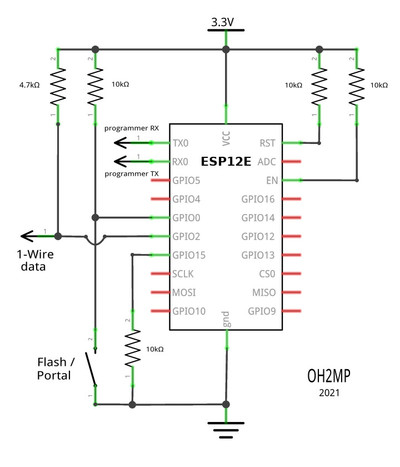
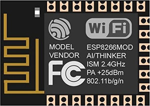
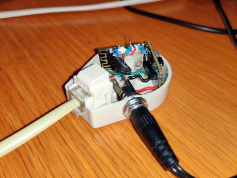

# ESP8266 DS1820 MQTT client

### A simple Web configurable MQTT client for ESP8266 and onewire ds1820

## Hardware prerequisities

- An esp8266 board
- One or more Dallas DS18?20 sensors

## Software prerequisities

- Some MQTT broker like Mosquitto running somewhere.
- [Arduino IDE](https://www.arduino.cc/en/main/software)
- [Arduino ESP8266 filesystem uploader](https://github.com/esp8266/arduino-esp8266fs-plugin)

Required libraries:

OneWire, DallasTemperature, ESP8266WiFi, ESP8266WiFiMulti, ESP8266WebServer, FS, PubSubClient

Use the filesystem uploader tool to upload the contents of data library. It contains the html pages for
the configuring portal.

## Connections

Connect your sensors to pin D4. This can be configured from the code too, see row `#define ONE_WIRE_BUS PIN_D4`

If you use parasite power, put a 4k7 resistor between 1wire data line and 3V3.

You can connect a switch between D3 and GND. If D3 is grounded, the esp8266 starts portal mode. The pin can be
also changed from the code, see row `#define APREQUEST PIN_D3`. This is the same pin where the FLASH switch
is connected in NodeMCU dev boards. If you're using one, you can use that.

By default the software assumes that there are maximum 8 sensors, but this can be changed from the code,
see row `#define MAX_SENSORS 8`

## Portal mode

When your board is in portal mode, it blinks the LED. Take your phone and connect to WiFi network 
**ESP8266 DS1820 MQTT** and accept that there's no internet connection etc.

Open your browser and go to `http://192.168.4.1/`

The web GUI should be self explanatory.

There's almost no sanity checks for the data sent from the forms. This is not a public web service and if you
want to mess up your board or make a denial of service to it using eg. buffer overflows, feel free to do so.

## Operation

The sketch sends the temperatures with MQTT. The interval can be configured from the portal. If it is set to 0,
then it will send the data constantly as fast as possible.

The MQTT packet is a JSON like this example:

`{"type":6,"t"=225}`

The __type=6__ comes for my "standard" that is explained at
[ESP32 BLE2MQTT docs](https://github.com/oh2mp/esp32_ble2mqtt/blob/main/DATAFORMATS.md) and parameter __t__ is
temperature in deciCelsius. On that example data the temperature is 22.5°C.

## Configuration option

The portal saves all configurations onto the SPIFFS filesystem. They are just text files, so you can 
precreate them and then you dont' have to use the portal at all. Just place yout configuration files into 
the data directory along the html files and upload them with ESP8266 filesystem uploader.

See [FORMATS.md](FORMATS.md).

## Schematic for ESP12E module

This is for ESP12E module. If you are using ESP12E DevKit a.k.a. NodeMCU, you don't need this.

**NOTE** The 4.7k resistor is needed **only** when parasite power is used. If the sensor is feed with VCC, 
then it can be left out. 

Ground wires of the sensor and programming interface have been left out from the schematic because they 
are just obvious.

## Example solution

An old telephone plug recycled as a circuit case. Because RJ11 is some kind of a standard for 
Dallas/Maxim 1-Wire, there are an ESP12E and 3.3V DC-DC buck converter in the plug where a female RJ11 
was already present. 

